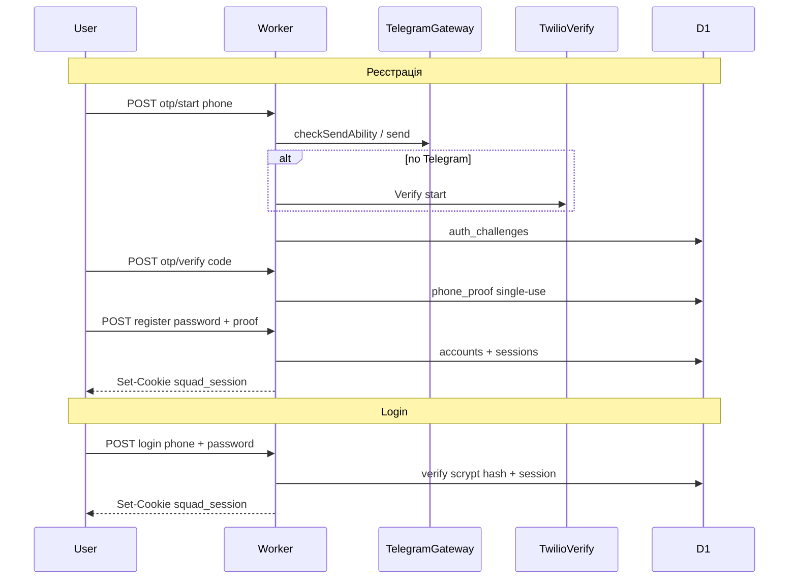

# План: реєстрація / аутентифікація

**Статус:** Phase 1–4 реалізовано (`src/worker/identity/` + client auth UI) + Phase 5 stub-таблиці;
покрито тестами (`npm test`). **Не зроблено** (потребує ручних дій
власника): Phase 0 secrets/alerts (реальні акаунти Twilio Verify /
Turnstile widget keys — див. `docs/provision.md` § "Identity / auth secrets";
Telegram Gateway уже live), і підтверджений CPU-time бенчмарк scrypt на
задеплоєних Workers (`npm run bench:scrypt` дає локальний Node sample).
Живий OTP у Dev/Prod: `OTP_SINK_MODE` відсутній → Telegram Gateway (+ Twilio
fallback коли credentials є); без `TURNSTILE_SECRET_KEY` у цьому режимі
`otp/start` **fail-closed** (`turnstile_misconfigured`). Локально/CI —
лише fake-провайдер (`OTP_SINK_MODE=log`) + Noop Turnstile.
Реєстраційний wizard збирає `nickname` на кроці пароля і передає його в
`POST /api/auth/register` (additive field; worker одразу робить sectional
nickname upsert). Post-auth onboarding (profile → disciplines → email) —
server-driven через `onboardingStep` на `/profile`. UI сповіщень зараз
лише email + Save (Telegram / email-OTP приховані до появи API).
— див. § "Profile при реєстрації" та § "Threat model / onboarding notes" нижче.
**Джерело рішень:** Obsidian `products/match-platform/specs/identity-auth.md`, `products/match-platform/specs/login-implementation.md`.

## Модель (вже прийнято)

| Дія | Як |
| --- | --- |
| **Login** | телефон + пароль → session (**без** OTP) |
| **Реєстрація** | телефон → OTP → пароль → `Account` → session |
| **OTP** | Telegram Gateway → Twilio Verify — **лише** verify номера |
| **Passwordless phone-only** | не в v1 |

У репо consumer auth **є**: Login / Register / Forgot password / Profile
([`LoginPage.tsx`](../../src/client/pages/LoginPage.tsx) та сусідні сторінки),
сесії через `squad_session`, D1 міграції `0002_identity.sql` …
`0010_disciplines_prompt_dismissal.sql`, Worker identity router у
[`src/worker/identity/routes.ts`](../../src/worker/identity/routes.ts)
(підключений з [`index.ts`](../../src/worker/index.ts)).

## Архітектура в репо

Новий модуль `src/worker/identity/` (роутер підключає з [index.ts](../../src/worker/index.ts)):

- `password.ts` — **scrypt через `@noble/hashes/scrypt`** (pure JS, без native/WASM deps — той самий критерій "Workers-friendly", але memory-hard і без непередбачуваних PBKDF2-iteration трейдофів)
- `session.ts` — opaque cookie `squad_session`, hash у D1, pepper `SESSION_SIGNING_KEY`
- `phone.ts` — E.164 normalize, легкий UA-first нормалізатор (без `libphonenumber` — зайва вага бандла): приймає `0XXXXXXXXX` / `380XXXXXXXXX` / `+380XXXXXXXXX` → `+380...`; інші коди країн приймаються як valid E.164, але без спец-UX
- `otp/gateway.ts`, `otp/twilio.ts` — адаптери за спільним інтерфейсом `OtpProvider` (`send` only; local code-hash verify is authoritative)
- `otp/fake.ts` — тестовий/dev-провайдер: код у лог замість реального відправлення (той самий підхід, що `NOTIFICATION_SINK_MODE=log` у `.dev.vars.example`); вмикається `OTP_SINK_MODE=log` — **обов'язково** для vitest/CI і локального dev, щоб не платити за реальні SMS/Gateway-виклики в тестах
- `rate-limit.ts` — D1 по phone + IP hash (прийнятно для MVP-масштабу; single-primary D1 write — відома межа масштабування, не блокер зараз)
- `onboarding.ts` — pure `computeOnboardingStep` + `dismissPrompt`
- `profileStore.ts` — profile SQL get/upsert
- `authHttp.ts` — `requireAuth` / `errorResponse` / Origin gate helpers
- `routes.ts` — thin dispatch table + handlers
- `src/shared/` — discipline allow-lists + shared validation regexes/constants (client + worker)

**Password hashing параметри:** scrypt `N=2^15, r=8, p=1` як стартові — **зафіксувати бенчмарком** у Phase 1 (реальний CPU-time тест на Workers, не лише локально) і скоригувати під CPU budget планового тарифу Workers. Якщо CPU budget не влазить — fallback на WebCrypto PBKDF2-SHA-256 ≥600 000 iterations (OWASP 2023 мінімум), але це саме fallback, не primary вибір.

**Пароль:** мін. 8, **макс. 128 символів** (захист від DoS через хешування надто довгого інпуту).

**Endpoints**

| Method | Path | Роль |
| --- | --- | --- |
| `POST` | `/api/auth/phone/otp/start` | OTP (purpose: register / change_phone / password_reset) |
| `POST` | `/api/auth/phone/otp/verify` | код → **phone proof** (не session) |
| `POST` | `/api/auth/register` | proof + password + **nickname** → Account + nickname profile + session (якщо акаунт уже є — оновити пароль + nickname + session, як reset) |
| `POST` | `/api/auth/login` | phone + password → session |
| `POST` | `/api/auth/logout` | revoke |
| `GET` | `/api/auth/me` | поточний account або 401 |
| `POST` | `/api/auth/password/reset` | proof + new password |
| `POST` | `/api/auth/phone/change` | (auth) reauthProofToken + OTP proof → update phone |
| `POST` | `/api/auth/reauth` | (auth) phone + password + purpose → short-lived single-use `reauthProofToken` (no new session) |
| `DELETE` | `/api/auth/account` | (auth + same-origin) видалення login/contact/profile PII зі збереженням реєстрацій |

**Phone proof:** single-use row у D1 (`phone_proofs`, TTL ~10 хв) — простіше інвалідувати, ніж лише signed cookie.

**Register conflict (жорстке правило):** `POST /api/auth/register` **не** робить
check-then-insert. Insert покладається на `UNIQUE(phone_e164)`; валідний
single-use register-proof для існуючого номера має ту саму силу, що password
reset: встановлює новий пароль, створює session і відкликає всі інші сесії.
Після успішної OTP-перевірки API безпечно повертає `accountMode`, щоб UI
попередив про reset до submit; register повторює остаточний
`accountMode: created | password_reset`.

**OTP ліміти (конкретні числа, не "потім вирішимо"):**
- Resend cooldown: **30 с** між повторними *новими* `otp/start` на той самий phone+purpose; якщо є ще `pending` challenge у cooldown — `otp/start` **перевикористовує** його (без нового SMS; захист від refresh → «занадто багато спроб»)
- Max sends: **8 / 15 хв** на phone+purpose, **20 / 15 хв** на IP
- Max verify attempts на challenge: **5**, потім challenge → `locked`, новий `otp/start` для продовження

**D1** — міграція `migrations/0002_identity.sql`: `accounts` (`phone_e164` UNIQUE, `password_hash`, `phone_verified_at`), `sessions`, `auth_challenges` (індекс `(phone_e164, purpose, created_at)` для rate-limit запитів), `phone_proofs`, `auth_rate_limits`. Stub-таблиці під Bot/Web Push можна додати в кінці або окремою міграцією.

**Secrets** (типи в [env.ts](../../src/worker/env.ts), checklist у [.dev.vars.example](../../.dev.vars.example) + [docs/provision.md](../provision.md) / inventory): `SESSION_SIGNING_KEY`, `TELEGRAM_GATEWAY_TOKEN`, `TWILIO_ACCOUNT_SID`, `TWILIO_AUTH_TOKEN`, `TWILIO_VERIFY_SERVICE_SID`.

**Session:** absolute TTL 30 днів; HttpOnly; Secure; SameSite=Lax; Origin check на state-changing auth POSTs. Cloudflare Access лишається лише Dev-операторським gate.

**Ревокація сесій (жорстке правило):** успішний `password/reset` і `phone/change` **обов'язково** ревокують усі інші активні сесії акаунта (крім щойно створеної при reset) — інакше атакер зі старою сесією лишається залогіненим після того, як власник відновив доступ.

## UI

- [App.tsx](../../src/client/App.tsx): маршрути `/login`, `/register`, `/forgot-password`, `/change-phone` (auth), `/profile`
- Замінити [LoginPage.tsx](../../src/client/pages/LoginPage.tsx); додати `RegisterPage` (wizard: phone → OTP → password)
- [ChangePhonePage.tsx](../../src/client/pages/ChangePhonePage.tsx): залогінений wizard — поточний номер + пароль → новий номер → OTP → `phone/change` (без OTP на старий номер; втрата телефону при живій сесії)
- **Auth exit footer (AUTH-006):** усі форми в `AuthLayout` використовують [`AuthExitLink`](../../src/client/components/AuthExitLink.tsx) / [`authExitTarget`](../../src/client/lib/authExit.ts) — signed-in → `/profile` («До профілю»), guest → `/` («На головну»). Не хардкодити окремі `Link` per-page. Канон UX — Obsidian `design/principles.md` § «Exit-лінк на auth-формах».
- [PublicHeader.tsx](../../src/client/components/PublicHeader.tsx): стан з `/api/auth/me` — Log in / Logout
- Рядки в [i18n.ts](../../src/client/i18n.ts) (ua/en); стилі форм у [styles.css](../../src/client/styles.css) у стилі існуючого public shell

**Політика пароля v1:** мін. 8, макс. 128 символів (без складної score-системи).

## Фази

### Phase 0 — Secrets & docs

Акаунти Gateway + Twilio Verify; secrets local/dev/prod; оновити `.dev.vars.example` (+ `OTP_SINK_MODE=log` за зразком `NOTIFICATION_SINK_MODE`), provision/inventory; нотатка як тестувати під Dev Access; **budget alert** на Gateway/Twilio витрати (Cloudflare notification / provider dashboard alert) — налаштувати одразу, доки лімітів на OTP ще немає.

### Phase 1 — Schema + password + session

Міграція `0002_identity.sql` (з індексом на `auth_challenges`); scrypt hash/verify helpers + **бенчмарк CPU-часу на Workers** для фіксації `N/r/p`; session create/load/revoke (в т.ч. revoke-all-except-current для reset-флоу); `me` / `logout`; unit-тести за патерном [concurrency.test.ts](../../src/worker/concurrency.test.ts) (vitest pool workers).

### Phase 2 — Phone OTP API

`OtpProvider` інтерфейс + Gateway/Twilio адаптери + **fake-провайдер** (`OTP_SINK_MODE=log`) для тестів/dev — жодного реального SMS-виклику в CI; `otp/start` + `otp/verify` → `phone_proofs`; fallback якщо немає TG / Gateway fail; resend cooldown (30с, з reuse pending challenge) + max sends (8/15хв phone, 20/15хв IP) + max verify attempts (5) з конкретних лімітів вище; **Turnstile на `otp/start`** — обов'язково перед публічним запуском (endpoint платить за кожен SMS/Gateway-виклик — класична мета pumping fraud, не чекаємо на інцидент); mock/smoke на власний номер.

### Phase 3 — Register / login / reset + UI

API `register` (атомарний insert на `UNIQUE(phone_e164)`; proof-authorized
password reset + revoke інших сесій при конфлікті), `login`, `password/reset`;
UI wizard + login + forgot; header session; безпечний `next` redirect; i18n.

### Phase 4 — Hardening

Rate limits login (per-account **і** per-IP lockout, не лише один з них); masked phone в логах; cron sweep expired challenges/sessions/proofs (існуючий `scheduled` stub); regression tests.

### Phase 5 — Notify hooks (light)

Stub `account_telegram_links` / `push_subscriptions` tables remain for future
APIs. **UI «Мої сповіщення»** на `/profile`: три **radio**-ряди (Email /
Telegram Bot / SMS) — вибір активного каналу окремо від статусу
підключення; radio **disabled**, поки канал disconnected; клік на
disconnected-іконку розгортає connect-панель. Якщо preference вказує на
непідключений канал — fallback на перший connected (зазвичай SMS).
Email: `POST /api/auth/account/email` (collection); OTP confirm — stub.
Telegram connect — UI shell / stub. SMS — `phoneE164` з auth як connected.
Preference radio поки **не** персиститься на бекенді (дефолт SMS).
Деталі продукту — Obsidian `products/match-platform/specs/notifications.md`.

## Profile при реєстрації (додано 2026-07-18, скориговано 2026-07-19)

Продуктове рішення (Obsidian `products/match-platform/specs/login-implementation.md`
§ "Додано 2026-07-18 — мінімальний Profile при реєстрації",
`products/match-platform/specs/user-profile.md`,
`products/match-platform/specs/notifications.md`): реєстраційний wizard
розширено мінімальним стрілецьким `Profile` (нова сутність, 1:1 з `Account`
через `account_id`, окрема таблиця `profiles`, `migrations/0003_profile.sql`
+ `0004_profile_club.sql` + `0005_profile_name_optional.sql` +
`0006_profile_prompt_dismissal.sql` + `0007_email_prompt_dismissal.sql` +
`0010_disciplines_prompt_dismissal.sql`) і
відкладеним кроком збору email.
**2026-07-19:** порядок кроків і механізм гарду скориговано — `nickname`
переїхав на крок пароля (required там), а сам крок "дані профілю" став
повністю опціональним (Save/Skip); стара вимога "хоча б один повний набір
імені" видалена.
**2026-07-19 (пізніше):** post-auth кроки (profile → email) винесено з
in-memory wizard на **server-driven onboarding** — `GET /api/auth/me`
повертає `onboardingStep`, клієнт рендерить відповідний UI.
**2026-07-20:** поверхня зведена до **`/profile`** (редагування анкети +
канали сповіщень). `/onboarding` і `/complete-profile` — лише redirect на
`/profile`. Pre-auth (phone → OTP → password+nickname) лишається in-page на
`/register`.
**2026-07-21:** між profile і email додано крок **`disciplines`** (дивізіон +
фактор потужності як дефолт для майбутніх реєстрацій) — той самий патерн
HintPanel + Skip / Save секції «Мої дивізіони».

**Pre-auth flow (`/register`):** телефон → OTP → **пароль (+ nickname,
required)** → `POST /api/auth/register` з `nickname` (worker робить sectional
nickname upsert у тому ж запиті) → navigate `/profile`.
Прогрес і контекстна підказка показуються у спільній «панелі підказки»
`PublicChrome` / `.app-top-chrome__hint` (`HintPanel`), не всередині
auth-картки; надалі той самий слот вміщуватиме резерв слотів реєстрації на матч.

**Post-auth (`/profile`, з `onboardingStep`):** **той самий** звичайний
двоколонковий `/profile` (аватар + міні-меню зліва; анкета / дивізіони /
сповіщення / дії справа). Onboarding **не** має окремого UI й **не** змінює
layout/controls форм. Єдиний onboarding-специфічний шар — та сама
`HintPanel` у `PublicChrome` (як на `/register`): контекстна
підказка + **«Пропустити»** / Skip. `onboardingStep === null` → той самий
page без hint у chrome. Дивізіони — звичайна незалежна секція з власним
Edit/Save/Cancel **і** перший-раз onboarding-крок (`"disciplines"`) між
profile та email.

- Крок пароля вимагає `nickname` (поряд з паролем) — клієнт надсилає його в
  `POST /api/auth/register` (не окремим post-auth `savingNickname` кроком).
  Worker валідує charset і робить sectional `section: "nickname"` upsert
  (решта полів існуючого профілю не змінюються — AUTH-001). Після успіху —
  `refresh()` + `/profile`.
- Крок "дані профілю", дивізіони й email живуть на `/profile` (не в `useState`
  wizard'а) — refresh завжди converging з DB.
  - `onboardingStep === "profile"`: звичайний view/Edit/Save/Cancel анкети;
    banner Skip → `POST /api/auth/account/profile-prompt/dismiss` (або Save
    анкети → `POST /api/profile` з `section: "profile"`). Після dismiss або
    Save → disciplines — той самий шлях, що клік лівого меню «Мої дивізіони»
    (`scrollToAnchor` / queued nav + window-only scroll до
    `#my-divisions`; не `scrollIntoView`, щоб
    `.public-surface { overflow: hidden }` не ховав PublicHeader).
  - `onboardingStep === "disciplines"`: звичайна секція дивізіонів у edit
    mode; banner Skip → `POST /api/auth/account/disciplines-prompt/dismiss`
    (або Save → `POST /api/profile` з `section: "disciplines"`, що також
    штампує dismissal). Після dismiss або Save → email — scroll до
    `#my-notifications` (клік «Мої сповіщення»).
  - `onboardingStep === "email"`: звичайна форма сповіщень (лише Save у
    формі); banner Skip → `POST /api/auth/account/email-prompt/dismiss`.
  - Немає Skip/footer усередині `ProfileForm` / `EmailChannelsForm`.
- `ProfileForm` + `EmailChannelsForm` + `ProfileSummary` + `HintPanel` —
  компоненти `/profile`. Ліве меню без card/tray chrome: «Мої матчі»,
  «Пов’язані стрільці» (placeholder із напрямками «Я реєструю» /
  «Мене реєструють»), далі smooth-scroll anchors `#my-profile`,
  `#my-divisions`, `#my-notifications`, `#profile-actions`. Scroll-spy
  тримає рівно один anchor активним за верхньою reading line, враховує
  sticky header і оновлює hash через `replaceState` без засмічення history;
  при `scrollY = 0` активний «Мій профіль» (навіть якщо коротка сторінка
  також на document-end). Верхня анкета й дивізіони мають незалежні
  Edit/Save/Cancel та dirty-confirmation. Верхня форма надсилає
  `section: "profile"`, уся секція дивізіонів — `section: "disciplines"`;
  кожне збереження merge-иться без overwrite іншої секції.
- «Змінити пароль» у діях профілю веде в наявний OTP reset flow.
- «Видалити профіль» відкриває in-app dark modal (не native browser popup),
  вимагає typed confirmation (`ВИДАЛИТИ` / `DELETE`) і явно попереджає, що
  акаунт, login/contact/profile дані буде стерто без можливості відновлення,
  але попередні й активні реєстрації на матчі залишаться. Dialog має initial
  focus, Escape/backdrop cancel лише до submit, focus containment/restore та
  inline pending/error state.
- Legacy `/onboarding` і `/complete-profile` → redirect на `/profile`.

**Поля `Profile` (усі опціональні; `gender`+`birthDate` або надсилаються
разом, або обидва відсутні):**

| Поле | Примітка |
| --- | --- |
| `firstNameUa` / `lastNameUa` | кирилиця якщо задано; `null`-able у БД |
| `firstNameEn` / `lastNameEn` | латиниця якщо задано |
| `nickname` | без обмеження алфавіту, лише без control-символів; збирається на кроці пароля, редагується повторно на кроці профілю |
| `gender` + `birthDate` | мають надсилатись **разом або обидва відсутні** — так проходить nickname-only upsert кроку пароля, і водночас "реальний" save кроку профілю лишається well-formed (не половинчастим); якщо задані — `gender` `male`\|`female`, `birthDate` ISO-дата, не в майбутньому, вік ≤120 |
| `upsfMember`, `region`, `city`, `club` | блок "Для матчів ФПСУ"; `club` — тимчасове вільнотекстове поле-заглушка (нема сутності `Club`), лише length-cap |
| `ipscMember`, `ipscMemberNumber`, `ipscRegion` | блок "Для матчів IPSC"; `ipscRegion` — uppercase, ≤5 символів, дефолт `"UA"`, якщо `ipscMember` та регіон не вказано |

Немає жодного cross-field правила "хоча б один повний набір імені" — воно
видалене: `nickname` з кроку пароля вже гарантує якусь ідентичність, а крок
профілю має бути повністю skip-able.

**Ендпоінти** (auth-required, той самий `squad_session`):
- `POST /api/profile` — sectional merge (`profile`, `disciplines`, `nickname`
  та вузькі legacy section keys) або legacy full-document Save,
  `ON CONFLICT(account_id) DO UPDATE` —
  атомарно, не check-then-insert. Встановлює `profiles.profile_completed_at`
  для `section: "profile"` / явного legacy full-document Save (усі поля можуть
  бути порожніми); nickname bootstrap не завершує profile-onboarding;
  `section: "disciplines"` не чіпає `profile_completed_at`, але штампує
  `accounts.disciplines_prompt_dismissed_at` (навіть якщо всі дисципліни
  disabled); ніколи не скидає
  вже встановлений `profile_completed_at` назад на `NULL` при пізнішому
  частковому оновленні.
- `GET /api/profile` — 404 якщо ще нема рядка.
- `POST /api/auth/account/profile-prompt/dismiss` — встановлює
  `accounts.profile_prompt_dismissed_at`, ідемпотентний.
- `POST /api/auth/account/disciplines-prompt/dismiss` — встановлює
  `accounts.disciplines_prompt_dismissed_at`, ідемпотентний.
- `POST /api/auth/account/email` — додає `accounts.email`, generic `409` при
  дублікаті — той самий no-enumeration підхід, що register-conflict; **не**
  verify-gated — v1 email — це просто contact/notify-адреса.
- `POST /api/auth/account/email-prompt/dismiss` — встановлює
  `accounts.email_prompt_dismissed_at`, ідемпотентний.
- `DELETE /api/auth/account` — authenticated + origin-protected destructive
  action. Один атомарний D1 `batch()` видаляє sessions, phone proofs/challenges,
  account/IP login-rate-limit rows, Telegram/Web Push links; очищає email;
  замінює телефон/password hash на non-authenticating opaque tombstone values
  та очищає всі live profile PII/discipline поля. Response очищає session
  cookie.

### Видалення акаунту й незмінність реєстрацій

`migrations/0009_account_deletion.sql` додає `deleted_at` до `accounts` і
перебудовує `profiles`: `account_id` стає nullable з `ON DELETE SET NULL` як
defensive FK seam, а профіль отримує `deleted_at`. Звичайний deletion flow
зберігає opaque Profile→tombstone Account link; Account і Profile не
cascade-delete-яться, щоб canonical future
`Registration.profile_id` та actor/creator FK не ламались. Незмінні submitted
registration snapshots, status, match/squad/payment/result зв'язки не
переписуються endpoint-ом. Поточний repo ще не має production registration
tables; worker test використовує FK fixture canonical форми
`Registration(profile_id, creator_account_id, status, snapshot...)` і доводить,
що active та historical rows лишаються валідними.

Оригінальні phone/email/password/profile PII після успіху недоступні; той самий
телефон може пройти OTP і створити новий `Account` з новим ID. Старі
реєстрації навмисно не relink-яться до нового акаунту автоматично.

**Відкрита legal/product policy:** до external beta треба затвердити legal
basis і retention для registration snapshots, payments/results та спосіб
data-subject export/pseudonymization. Ця реалізація виконує продуктове правило
цілісності подій, але не визначає строк зберігання цих записів.

**Гард `onboardingStep` (заміна `showProfilePrompt`-only):**
`GET /api/auth/me` повертає обчислене `onboardingStep`:
- `"profile"` — якщо `profile_prompt_dismissed_at IS NULL` і
  `profiles.profile_completed_at IS NULL`;
- `"disciplines"` — інакше, якщо `disciplines_prompt_dismissed_at IS NULL` і
  жодна дисципліна ще не `enabled`;
- `"email"` — інакше, якщо `email_prompt_dismissed_at IS NULL` і
  `accounts.email IS NULL`;
- `null` — інакше.

Пріоритет завжди profile → disciplines → email → null. `showProfilePrompt`
лишається як alias (`onboardingStep === "profile"`) для сумісності.

**Існуючі акаунти:** новий `disciplines_prompt_dismissed_at` /
`email_prompt_dismissed_at` дефолтно `NULL` — хто вже пропустив/заповнив
профіль, але не має enabled-дисциплін / email і ніколи не бачив відповідний
крок, побачить його **один раз** (простий default, без backfill). Акаунти з
хоча б однією enabled-дисципліною крок `disciplines` пропускають.

Клієнтський `OnboardingGuard` (`App.tsx`): якщо залогінений і
`onboardingStep != null` — форс-редірект на `/profile` (окрім
login/register/forgot-password/change-phone, `/profile` і legacy alias-ів).
Login після успіху теж веде на `/profile`, якщо крок ще pending
(пріоритетніше за `?next=`). Без pending onboarding і без `?next=` —
`safeNextPath` / `AUTHENTICATED_HOME_PATH` = `/matches` («Мої матчі»).
Залогінений `/` завжди редіректить на `/matches`. Окремі маршрути:
`/matches`, `/linked-shooters`, `/profile` (+ hash-якорі для секцій
профілю). Header logo (залогінений) → `/matches`; «Профіль» → `/profile`.

**Явно поза scope:**
`upsf_rank`/`ipsc_class` (потрібні довідники), і "справжня" сутність
`Club`/`selected_club_id` (`club` вище — лише тимчасовий вільнотекстовий
плейсхолдер) — належить майбутній фічі форми реєстрації на матч. Email OTP
confirm, Telegram Bot linking API і Web Push / SMS notify preferences —
окремий трек (UI «Мої сповіщення» — radio-ряди + connect shells; live
лишається collection `Account.email` + SMS phone з auth). URL-кроки для
pre-auth phone/OTP/password (option 1) — поза scope цього зміни.

**Дисципліни профілю (додано 2026-07-20; onboarding-крок 2026-07-21):** на
`/profile` дивізіони — окрема секція з власним Edit/Save/Cancel
(`section: "disciplines"`), незалежна від анкети. Після profile-кроку
`onboardingStep === "disciplines"` показує HintPanel + auto-edit + scroll до
«Мої дивізіони»; Skip/Save завершують крок і ведуть до email. Пізніше секція
лишається незалежно редагованою. Блоки: pistol/carbine/pcc_mini_rifle/shotgun
(expand з division + power_factor). Миграції `0008_profile_disciplines.sql` +
`0010_disciplines_prompt_dismissal.sql`; довідники —
`src/shared/disciplines.ts` (з Obsidian `divisions-classes.md`; client/worker
тонкі re-export).
UA/EN імена вкладені під членство ФПСУ/IPSC; при знятому чекбоксі nested
поля очищаються на save.

## Threat model / onboarding notes

**Register-as-reset:** a valid `register`-purpose phone proof is treated as
password-reset authority when `phone_e164` already exists. Attackers who
complete OTP for someone else's phone can set a new password and revoke other
sessions — the same capability as `/api/auth/password/reset`. Mitigation is
OTP delivery security (Turnstile on `otp/start`, rate limits, channel trust),
not a separate "phone already registered" rejection. UX surfaces a warning
when `accountMode === "password_reset"` after verify.

**Onboarding state machine** (`src/worker/identity/onboarding.ts`):
priority `profile → disciplines → email → null`.

| Step | Done when |
| --- | --- |
| `profile` | `profile_prompt_dismissed_at` set **or** `profiles.profile_completed_at` set |
| `disciplines` | `disciplines_prompt_dismissed_at` set **or** any discipline enabled (successful `section: "disciplines"` save also stamps dismissal) |
| `email` | `email_prompt_dismissed_at` set **or** `accounts.email` set |

Client never owns this machine — only renders `GET /api/auth/me.onboardingStep`.
Dismiss endpoints remain path-stable; worker uses one `dismissPrompt(column)`.

## Безпека (обов'язково)

- Не логінити пароль/OTP; phone mask
- Constant-time compare для password verify (scrypt); макс. довжина пароля 128 символів
- Без зайвого account enumeration (login: generic error; `password_reset` без акаунта → той самий `invalid_or_expired_proof`)
- Register: атомарний insert на `UNIQUE(phone_e164)`, не check-then-insert (race condition). Якщо телефон уже є — **валіідний register-proof = повноваження як у password reset**: оновити `password_hash`, видати session, revoke інших сесій (не `409 phone_already_registered`)
- Proof single-use + короткий TTL
- Password reset / register-as-reset / phone change → **revoke усіх інших сесій** акаунта
- `GET /api/auth/me` з орфанним/протухлим cookie → 401 + clear cookie
- Turnstile на `otp/start` з дня публічного запуску (SMS/Gateway-виклики коштують гроші — cost-vector, не чекаємо на інцидент)
- Тести й local dev — лише fake OTP provider (`OTP_SINK_MODE=log`); нуль реальних SMS/Gateway-викликів у CI
- Budget alert на Gateway/Twilio витрати
- Access ≠ consumer auth

## Поза scope v1

Phone-only passwordless; email/OIDC/Firebase; OTP на кожен login; повний Bot/Web Push send; локальні UA SMS/Viber; auth Durable Object.
